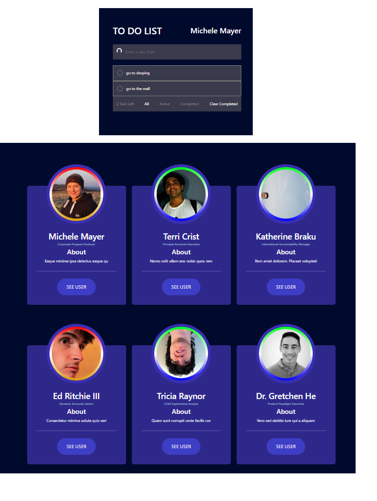

# Todo App for users RestAPI

[WITP](https://todo-app-react-axios.netlify.app): React app created with Vite [Vite](https://vitejs.dev/) that consume [UserApi](https://mockapi.io/) API

## App Live Demo

[](https://app.netlify.com/sites/todo-app-react-axios/deploys)

👉 https://todo-app-react-axios.netlify.app

---



---
## Project setup
```markdown
# Install
npm install

# Compiles and hot-reloads for development
npm run dev

# Compiles and minifies for production
npm run build

# Preview production version
npm run preview

```

---